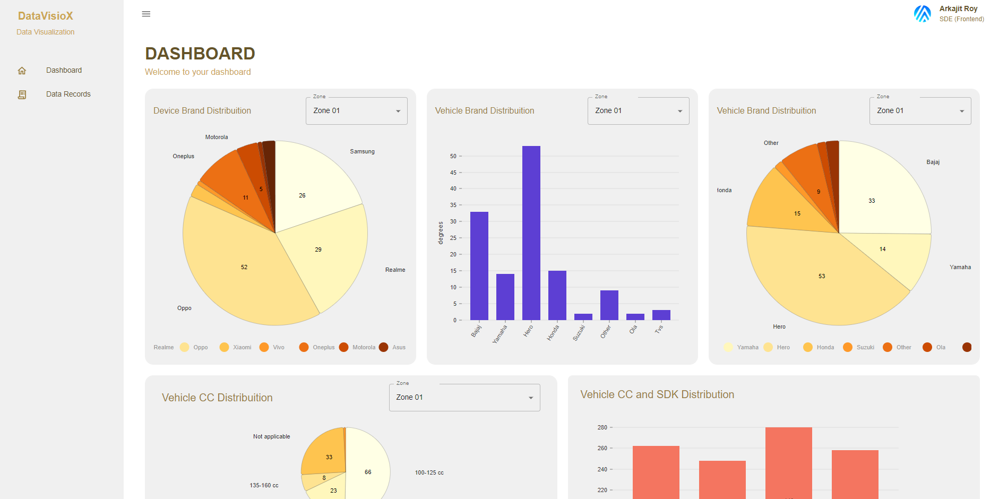
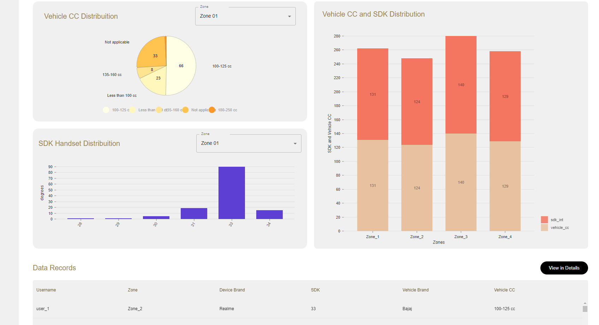
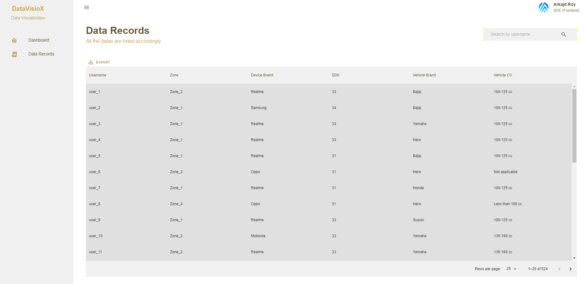
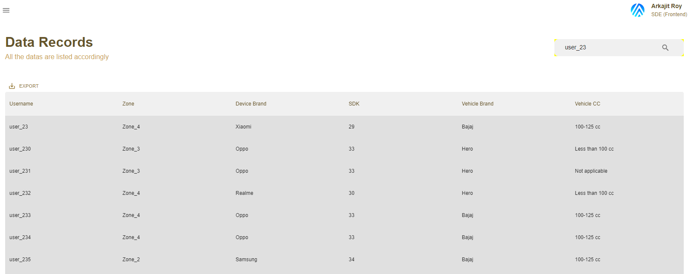
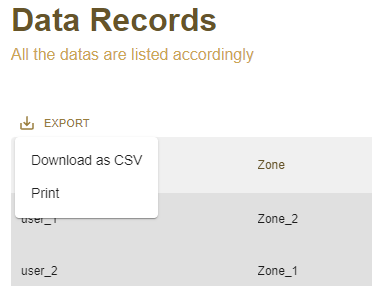
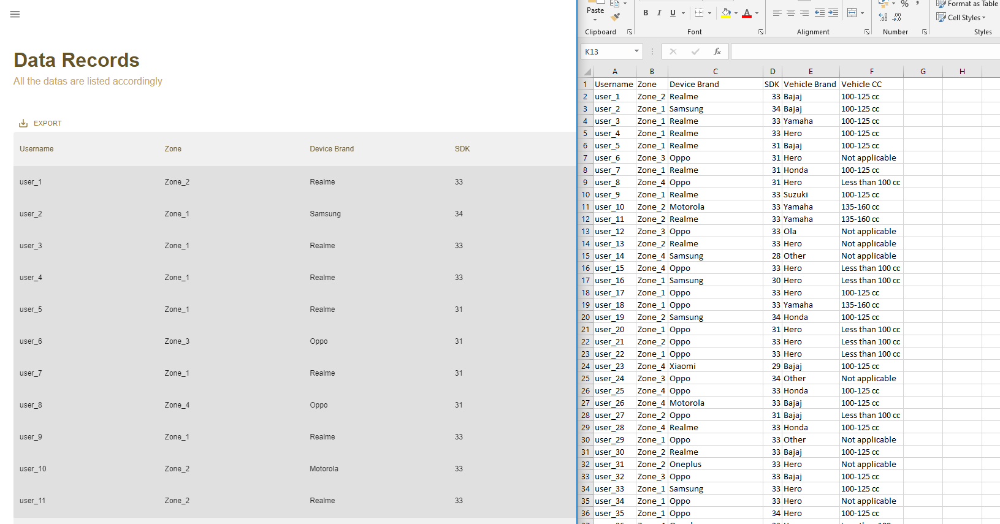

# Documentation for Data Visualization Dashboard

This documentation outlines the structure and components of the dashboard project developed for **Altor**, as part of the hiring process for the **SDE Frontend Role**. The dashboard project focuses on data visualization components to provide insightful representations of data for Altor's needs.

**Submitted by:** Arkajit Roy (arkajitroy11.official@gmail.com)
**Applied For:** SDE-Frontend Role

### 📌 Tech stack used for this project

| Libraries Used For            | Details                                                                                                                                           |
| ----------------------------- | ------------------------------------------------------------------------------------------------------------------------------------------------- |
| **React-JS**                  | Utilized ReactJS as the frontend library for building dynamic user interfaces. Library                                                            |
| **Typescript**                | Employed Typescript as the programming language for enhanced code readability and maintainability.                                                |
| **Nivo Charts**               | Integrated Nivo Charts for comprehensive data visualization, offering a wide range of chart types and customization options.                      |
| **Material UI v5.15**         | Implemented Material UI Library version 5.15 for designing consistent and visually appealing user interface components.                           |
| **Material-UI 6 (Data-Grid)** | Material-UI Data-Grid version 6 for efficient representation of tabular/grid data, providing features such as sorting, filtering, and pagination. |
| **Axios**                     | Axios Library for making HTTP requests to fetch data from the server, ensuring smooth data retrieval and management.                              |

### ⚡ Prerequisites and Installation Guide

To Run the project, at first you we need to clone the project from the repository

```
git clone https://github.com/arkajitroy/altor_sde_assignment
```

After we successfully cloning the project, Navigate to the project directory `source_code`
And quickly install the dependencies by using `npm install`

After installation of all dependencies start the server from the terminal.

```
npm run dev
```

## 📌 Overall Summary of the project

### :star: Homepage (Main Dashboard)

This is first glimpse of our Dashboard Application, your gateway to a wealth of informative charts meticulously crafted to meet the specifications outlined in our assignment. Dive into a visual feast of multiple charts, each meticulously designed to depict crucial data points, as per our assignment requirements.

#### :small_orange_diamond: Details about the Chart

**01. Device Brand Distribution over Zone(s) - Pie Chart:**
This Offers a pie chart representation showcasing the percentage distribution of each device brand. Includes a zone-based filter allowing users to view data specific to selected zones.

**02. Distribution of Total Number of Vehicles over Different Vehicle Brands - Bar Chart:**
Utilizes Nivo Charts to showcase the distribution of vehicle engine capacities (CC) across different zones. Represents the distribution using a pie chart, depicting the percentage share of each engine capacity range.

**03. Vehicle Brand Distribution over Zone(s) - Pie Chart:**
This Presents a pie chart illustrating the proportion of each vehicle brand in the selected zones. Provides a zone filter option for users to narrow down data based on specific zones.



**04. Vehicle CC Distribution over Zone(s) - Pie Chart:**

Utilizes Nivo Charts to showcase the distribution of vehicle engine capacities (CC) across different zones. Represents the distribution using a pie chart, depicting the percentage share of each engine capacity range. Incorporates a zone filter feature enabling users to view data pertaining to specific zones.

**05. Distribution of Total Number of Vehicles over Different Vehicle Brands - Bar Chart**

This is visualization of the total number of vehicles across various vehicle brands within the selected zones. Presents a bar chart illustrating the count of vehicles for each brand. Provides a zone filter option for users to customize the view based on selected zones.

**06. Stacked Bar Chart for Comparing Count or Distribution Between Zones: (Brownie Points)**

Implements a stacked bar chart to compare the count or distribution between zones for vehicle engine capacities and SDK Int values. Offers a visual comparison between zones, showcasing the distribution of data in a stacked format. Enables users to analyze differences between zones for vehicle engine capacities and SDK Int values.



### :star: Data Records Page (Data-Grid Representation)

This is the Data Grid page, a centralized hub housing all records meticulously stored for your convenience. Our feature-rich Data Grid component offers seamless access to vast datasets, coupled with built-in sorting and filtering functionalities for effortless data exploration and analysis.

Whether you're seeking specific records or conducting in-depth analysis, our Data Grid page provides the tools you need for seamless data exploration and management. Dive in and unlock the power of organized data representation at your fingertips.



##### :small_orange_diamond: Search Toolbar Feature

At the top of the page, there is a search bar where users can easily search for records by providing data according to the attribute. Here, the search is based on the username attribute as mentioned in the assignment.

For example, if I input `user_23`, the system retrieves records containing user_23 in the username. It's important to note that it retrieves all users whose username starts with user_23.



#### :small_orange_diamond: CSV Download Feature

Additionally, we offer a convenient feature allowing users to download the entire dataset in CSV format, enabling seamless storage and access on their local systems. This built-in functionality is seamlessly integrated into the Material UI Grid, ensuring effortless data management at your fingertips.



#### Sample Output of the CSV



### :star: Additional Points and Information

There are some additional information which i have used and implemented in this project

#### :small_orange_diamond: Data Catching

To optimize data retrieval and enhance application performance, `sessionStorage`, a browser-based web storage mechanism, has been leveraged. This efficient solution caches API responses, enabling swift data fetching and seamless app operation without the need for repetitive API calls.

#### :small_orange_diamond: UI Components

The project harnesses the power of `MaterialUI v5` for its UI components, providing an array of advanced features tailored to elevate user experience. With built-in responsive capabilities, Material UI v5 streamlines the development process, eliminating the need for manual media queries in CSS and ensuring seamless responsiveness across devices.

## :star: Endnote

Thank you for the opportunity to interview for the SDE Frontend Role and I look forward to your feedback. If you have any questions or require further clarification on any aspect of the submission, please don't hesitate to reach out. I am more than happy to provide any assistance needed.

Here is my contact details and portfolio link!
**Submitted by:** Arkajit Roy [arkajitroy11.official@gmail.com](arkajitroy11.official@gmail.com)
**Portfolio Link** [Arkajit Roy Portfolio](https://arkajit-roy.vercel.app/)
